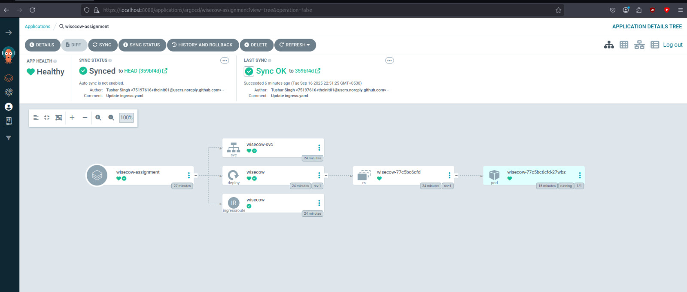

# Wisecow Assignment

## Overview

This repository contains the solution for the **Accuknox DevOps Trainee Practical Assessment**.

---

## Problem Statement 1: Containerization and Deployment of Wisecow Application

### Objective
The Wisecow application has been containerized and deployed on a Kubernetes environment with the following features:
- **Dockerization**: A `Dockerfile` is provided to build the Wisecow application image.
- **Kubernetes Deployment**: Kubernetes manifests are included for deploying the application.
- **CI/CD Pipeline**: A GitHub Actions workflow automates the build and push process. It builds a new image with the git commit as a tag and pushes it to dockerhub.
- **TLS Implementation**: The application is secured with TLS communication using Kubernetes Traefik Ingress.

### Artifacts
- **Dockerfile**: 
- **Kubernetes Manifests**: 
  - `deployment.yaml` 
  - `service.yaml` 
  - `ingress.yaml`
- **GitHub Actions Workflow**: Located in `.github/workflows/build-image.yaml`, it automates the CI/CD pipeline.

The application is deployed with the manifests in a KinD Cluster using ArgoCD



A self-signed certificate was used to expose the application behind an ingress resource 


## Problem Statement 2: Scripting Objectives
### Objective
Two scripting tasks were implemented using Bash:

#### System Health Monitoring Script:

- Script: scripts/health_monitoring.sh
- Monitors CPU usage, memory usage, disk space, and running processes.
- Logs alerts to /var/log/system_health.log if thresholds are exceeded.

#### Automated Backup Solution:

- Script: scripts/backup.sh
- Automates the backup of a specified directory to a remote server.
- Logs the success or failure of the backup operation to /var/log/backup.log.

### Problem Statement 3: Zero-Trust KubeArmor Policy
A zero-trust KubeArmor policy was written and applied to the Kubernetes workload deployed in Problem Statement 1.

[The kubearmor file](./manifests/kubearmor-policy.yaml)

The steps follwed were:
1. By default the security posture is set to audit. Lets change the security posture to default deny.
```bash
kubectl annotate ns default kubearmor-file-posture=block --overwrite
```
2. Lets try to execute some other processes:

```bash
kubectl exec -it wisecow-77c5bc6cfd-27wbz -- bash
>$ curl google.com
```
Any binary other than bash, nc, fortune, cowsay would be permission denied.
